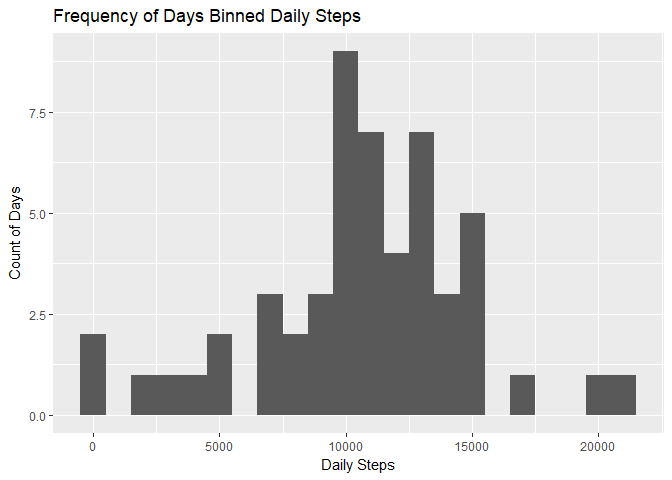
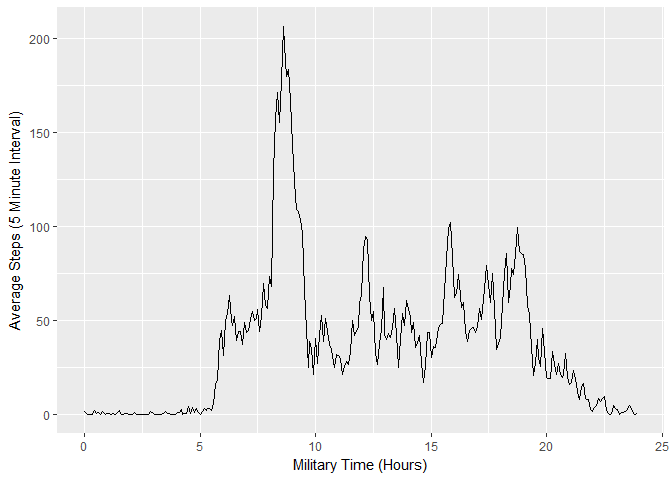
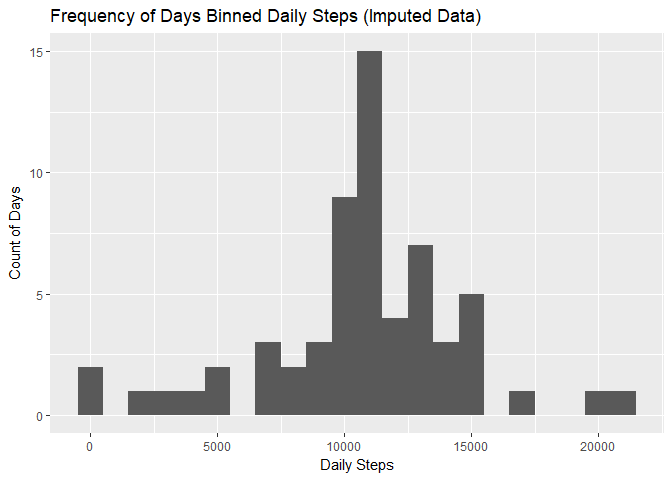
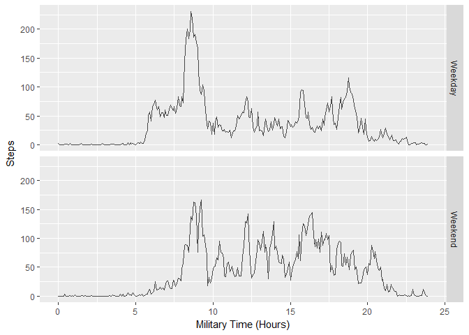

## Loading and preprocessing the data
The data is loaded from the URL and then unzipped from them. To process the data I've loaded tidyverse and lubridate.

The biggest complication with this data is the way that date and time are stored.  I used lubridate to create a dts column to uniquely identify the time. I also converted interval into a decimal number so that it can be plotted over 24 hours more easily.

```r
library(tidyverse)
```

```
## -- Attaching packages ---------------------------------------------------------------------------------------------------------------- tidyverse 1.2.0 --
```

```
## v ggplot2 2.2.1     v purrr   0.2.4
## v tibble  1.3.4     v dplyr   0.7.4
## v tidyr   0.7.2     v stringr 1.2.0
## v readr   1.1.1     v forcats 0.2.0
```

```
## -- Conflicts ------------------------------------------------------------------------------------------------------------------- tidyverse_conflicts() --
## x dplyr::filter() masks stats::filter()
## x dplyr::lag()    masks stats::lag()
```

```r
library(lubridate)
```

```
## 
## Attaching package: 'lubridate'
```

```
## The following object is masked from 'package:base':
## 
##     date
```

```r
#setwd("C:/Users/Michael.giessing/Box Sync/Michael Giessing/Courses/Coursera/ReproducibleResearch/data")
#Download data
download.file('https://d396qusza40orc.cloudfront.net/repdata%2Fdata%2Factivity.zip','RepeatDataActivity.zip')
unzip('RepeatDataActivity.zip')
df <- read.csv('activity.csv' )

#Lubradate the interval and date
df <- tbl_df(df) %>%
  mutate( dts = ymd_hm(paste(df$date, sprintf("%d:%02d",df$interval %/% 100,df$interval %% 100)))) %>%
  mutate(interval = hour(dts)+minute(dts)/60 )
```


## What is mean total number of steps taken per day? 

```r
#summarise data for plotting
p<-df %>%
  filter(!is.na(steps))%>%
  select(-interval)%>%
  group_by(date)%>%
  summarise(dailysteps=sum(steps))
#plot
qplot(p$dailysteps, binwidth = 1000, xlab= "Daily Steps", ylab = "Count of Days", main = "Frequency of Days Binned Daily Steps")
```

<!-- -->

The mean total steps is 10766.19 and the median is 10765


## What is the average daily activity pattern?


```r
intervalaverage <- df %>%
  group_by(interval) %>%
  filter(!is.na(steps)) %>%
  summarise(AverageSteps = mean(steps))

#qplot(as.numeric(hms(interval))/3600,AverageSteps,data = intervalaverage,geom ='line')
qplot(interval, AverageSteps, data = intervalaverage, geom ='line', xlab = "Military Time (Hours)", ylab= "Average Steps (5 Minute Interval)")
```

<!-- -->


```r
ia <- intervalaverage %>%
    filter(AverageSteps == max(AverageSteps)) %>%
    select(interval)
ia <- paste(trunc(ia) ,":",60*(ia-trunc(ia)),sep="")
```
The 5-minute interval 8:35 contains the maximum steps on average.

## Imputing missing values
The total number of missing values is 2304.  These will be imputed by using the average steps for that time interval.  Imputing added to the hieght of the bin over 10000.  This might be because number of steps in the imputed values is just at 10766.19. In most cases it seem the imputation replaced entire days so it would create days with that number of steps.


```r
#Imputing by coalescing in the AverageSteps when steps is NA
df1 <-  tbl_df(df) %>%
  inner_join(intervalaverage, by = c("interval")) %>%
  mutate(steps = coalesce(as.double(steps),AverageSteps)) %>%
  select(-AverageSteps)

#summarise data for plotting
p<-tbl_df(df1) %>%
  select(-interval)%>%
  group_by(date)%>%
  summarise(dailysteps = sum(steps))
#plot
qplot(p$dailysteps, binwidth = 1000 , xlab= "Daily Steps", ylab = "Count of Days", main = "Frequency of Days Binned Daily Steps (Imputed Data)")
```

<!-- -->

## Are there differences in activity patterns between weekdays and weekends?
In the chart below.  You can see that ther are diferences between the average weekday and weekend activity. On a weekday. Ther is more activity early in the morning.  There are higher peaks in acativity  on a weekend throughout the day.  Interestingly there seems to be a peak in activity near 8:35am on both weekdays and weekends. 

```r
p1<-df1 %>%
  mutate(Weekday = weekdays(dts) ) %>%
  mutate(Weekend = ifelse( Weekday == 'Saturday'| Weekday == 'Sunday',"Weekend","Weekday"  )) %>%
  group_by(interval, Weekend) %>%
  summarise(dayofweeksteps=mean(steps))


ggplot(data=p1, aes(x=interval , y= dayofweeksteps)) +geom_line(alpha = .7)+ facet_grid(Weekend~.) + labs(x= "Military Time (Hours)",y ="Steps") 
```

<!-- -->
